# 📋 Plano de Execução Multi-Agente (TASKS.md) - Urna Commit Jr.

Este documento estabelece o fluxo de trabalho detalhado, a divisão em fases/ondas (waves), a atribuição por agente e a matriz de isolamento de arquivos para garantir **execução paralela sem sobreposição de código ou conflitos de merge**.

---

## 🎯 Arquitetura de Orquestração Multi-Agente

Para evitar concorrência destrutiva entre agentes, o projeto é dividido em **Fases Sequenciais** e **Trilhas Paralelas Isoladas**. Cada agente possui um escopo rígido de arquivos e dependências claras.

```mermaid
flowchart TD
    subgraph Wave1["Onda 1: Fundação & Infraestrutura (Agente 1 - Lead Setup)"]
        T101["TASK-101: Scaffold Next.js + TS + Tailwind"]
        T102["TASK-102: Migração e Otimização de Assets"]
        T103["TASK-103: Setup do Banco de Dados & Schema ORM"]
        T101 --> T102 --> T103
    end

    subgraph Wave2["Onda 2: Desenvolvimento Paralelo Isolado"]
        subgraph TrackA["Trilha A: Frontend Urna & Som (Agente 2)"]
            T201["TASK-201: Web Audio Engine (Sem Latência)"]
            T202["TASK-202: Layout 100dvh & Display LCD"]
            T203["TASK-203: Teclado Virtual & Físico"]
            T204["TASK-204: Máquina de Estados da Votação"]
            T201 --> T202 --> T203 --> T204
        end

        subgraph TrackB["Trilha B: API Core & Voto Único (Agente 3)"]
            T301["TASK-301: Seed & CRUD de Candidatos API"]
            T302["TASK-302: Ciclo da Eleição & Middleware"]
            T303["TASK-303: Processamento Atômico de Votos"]
            T304["TASK-304: Mecanismo Anti-Voto Duplicado"]
            T301 --> T302 --> T303 --> T304
        end

        subgraph TrackC["Trilha C: Painel Administrativo (Agente 4)"]
            T401["TASK-401: Auth & Sessão Segura Admin"]
            T402["TASK-402: Dashboard & Controle de Ciclo"]
            T403["TASK-403: Gestão de Candidatos (UI Admin)"]
            T404["TASK-404: Apuração em Tempo Real & Gráficos"]
            T401 --> T402 --> T403 --> T404
        end
    end

    subgraph Wave3["Onda 3: Integração & Homologação (Agente 5 - QA & Lead)"]
        T501["TASK-501: Integração Frontend Urna com Backend"]
        T502["TASK-502: Teste de Carga Concorrente (~30 users)"]
        T503["TASK-503: Responsividade Cross-Device & Clean Up"]
        T501 --> T502 --> T503
    end

    Wave1 --> Wave2
    TrackA --> Wave3
    TrackB --> Wave3
    TrackC --> Wave3
```

---

## 🛡️ Matriz de Isolamento de Arquivos (Prevenção de Conflitos)

| Agente / Trilha | Diretórios e Arquivos Permitidos | Arquivos Proibidos / Read-Only |
| :--- | :--- | :--- |
| **Agente 1 (Fundação)** | Raiz (`package.json`, `tsconfig.json`, `tailwind.config.*`), `public/assets/`, `src/lib/db/` | N/A (Fase exclusiva) |
| **Agente 2 (Urna UI & Audio)** | `src/components/urna/`, `src/hooks/useAudio.ts`, `src/hooks/useVotingMachine.ts`, `src/app/page.tsx`, `src/styles/urna.css` | `src/lib/db/`, `src/app/admin/`, `src/app/api/admin/` |
| **Agente 3 (API & Voto)** | `src/app/api/election/`, `src/app/api/vote/`, `src/app/api/candidates/`, `src/lib/voting/`, `src/lib/fingerprint/` | `src/components/urna/`, `src/app/admin/`, `src/components/admin/` |
| **Agente 4 (Admin UI & Auth)** | `src/app/admin/`, `src/components/admin/`, `src/app/api/admin/`, `src/lib/auth/`, `src/hooks/useAdmin.ts` | `src/components/urna/`, `src/hooks/useVotingMachine.ts` |
| **Agente 5 (QA & Integração)** | Testes (`tests/`, `scripts/`), ajustes finos de integração e remoção de `tmp/` | Modificações estruturais sem validação |

---

## 📦 Detalhamento das Tarefas

---

### 🌊 ONDA 1: Fundação, Infraestrutura & Setup Base (Agente 1)
> *Nota: Esta onda deve ser concluída antes do início das trilhas paralelas da Onda 2.*

#### `[x]` TASK-101: Inicialização do Next.js 14+ com App Router, TypeScript e Tailwind CSS
- **Objetivo:** Criar o scaffold base do projeto mantendo os arquivos de configuração existentes (`AGENTS.md`, `ESCOPO.md`, `.gitignore`, `.agents/`).
- **Dependências:** Nenhuma.
- **Arquivos:** `package.json`, `tsconfig.json`, `tailwind.config.ts`, `postcss.config.js`, `src/app/layout.tsx`, `src/app/globals.css`.
- **Critérios de Aceite:**
  - Next.js configurado com App Router e TypeScript em modo estrito (`strict: true`).
  - Tailwind CSS instalado e funcionando com suporte a `100dvh` e fontes mono/sans.
  - Script `npm run build` e `npm run dev` executando sem erros.
- **Commit:** `chore: inicializa projeto Next.js com TypeScript e Tailwind CSS`

#### `[x]` TASK-102: Migração e Otimização dos Assets
- **Objetivo:** Mover os assets estáticos de `tmp/` para os diretórios definitivos sob `public/assets/` e criar o seed inicial.
- **Dependências:** `TASK-101`.
- **Arquivos:**
  - `public/assets/audio/tecla.mp3`
  - `public/assets/audio/fim.mp3`
  - `public/assets/images/brasao.png`
  - `public/assets/candidates/andre_guilherme.jpeg`
  - `public/assets/candidates/arhur_cordeiro.jpeg`
  - `public/assets/candidates/joao_vitor.jpeg`
  - `src/data/seed-candidatos.json`
- **Critérios de Aceite:**
  - Todos os arquivos copiados para os caminhos corretos e verificados.
  - `seed-candidatos.json` criado com a tipagem correspondente (`nome`, `numero`, `cargo`, `foto_url`).
- **Commit:** `chore: migra assets de audio, imagens e seed de candidatos`

#### `[x]` TASK-103: Setup de Banco de Dados com Neon PostgreSQL & Drizzle ORM
- **Objetivo:** Configurar cliente Neon Serverless, Drizzle ORM (ou Prisma), esquemas relacionais e migrações.
- **Dependências:** `TASK-101`, `TASK-102`.
- **Arquivos:** `src/lib/db/index.ts`, `src/lib/db/schema.ts`, `src/types/database.ts`, `drizzle.config.ts` (ou `prisma/schema.prisma`), `src/lib/db/seed.ts`.
- **Critérios de Aceite:**
  - Tabelas modeladas: `elections`, `candidates`, `votes`, `voter_records` conforme seção 5 do ESCOPO.md.
  - Script de seed funcional populando a eleição padrão e candidatos iniciais.
  - Tipos TypeScript exportados em `src/types/database.ts`.
- **Commit:** `feat(db): configura conexao neon postgresql, schemas e seed`

---

### 🌊 ONDA 2: Desenvolvimento Paralelo Especializado

---

#### 🎨 TRILHA A: Frontend da Urna & Sistema de Áudio (Agente 2)

#### `[x]` TASK-201: Web Audio Engine de Baixa Latência (`useAudio`)
- **Objetivo:** Criar hook/módulo de reprodução de áudio que pré-carrega os sons e executa sem delay em navegadores desktop e móveis (iOS/Android).
- **Dependências:** `TASK-102`.
- **Arquivos:** `src/hooks/useAudio.ts`, `src/lib/audio/soundEffects.ts`.
- **Critérios de Aceite:**
  - Pré-carregamento imediato de `tecla.mp3` e `fim.mp3`.
  - Tratamento de desbloqueio de áudio no primeiro toque/interação do usuário.
  - Suporte a chamadas repetidas e rápidas de `playKeySound()` e `playEndSound()`.
- **Commit:** `feat(audio): implementa engine web audio para tecla e encerramento`

#### `[ ]` TASK-202: Layout Base da Urna (`100dvh` Sem Scroll) e Display LCD
- **Objetivo:** Construir o contêiner visual da urna eletrônica respeitando proporções reais, com layout sem rolagem em qualquer dispositivo.
- **Dependências:** `TASK-101`.
- **Arquivos:** `src/components/urna/UrnaContainer.tsx`, `src/components/urna/DisplayLCD.tsx`, `src/components/urna/CandidatePreview.tsx`.
- **Critérios de Aceite:**
  - Ocupação exata de `100dvh` com `overflow-hidden`.
  - Display LCD com estilização idêntica à urna (área de cargo, número digitado piscando, foto do candidato, nome e legendas).
  - Estado visual de "VOTO EM BRANCO" e "NÚMERO ERRADO / VOTO NULO".
- **Commit:** `feat(ui): implementa layout responsivo sem scroll e display lcd da urna`

#### `[ ]` TASK-203: Teclado Virtual Numérico e Teclas de Ação + Suporte a Teclado Físico
- **Objetivo:** Implementar o teclado característico da urna com os botões numéricos (0 a 9) e botões de ação (BRANCO, CORRIGE, CONFIRMA), com feedback sonoro e visual.
- **Dependências:** `TASK-201`, `TASK-202`.
- **Arquivos:** `src/components/urna/Keypad.tsx`, `src/components/urna/KeyButton.tsx`, `src/hooks/usePhysicalKeyboard.ts`.
- **Critérios de Aceite:**
  - Botões coloridos com relevo e fontes fiéis: BRANCO (branco), CORRIGE (laranja), CONFIRMA (verde maior).
  - Captura de teclas físicas (0-9, Backspace para Corrige, Enter para Confirma).
  - Acionamento sonoro instantâneo em cada clique/tecla.
- **Commit:** `feat(ui): cria teclado numerico virtual e mapeamento de teclado fisico`

#### `[ ]` TASK-204: Máquina de Estados da Votação (`useVotingMachine`) & Tela FIM
- **Objetivo:** Controlar a sequência de votação entre os cargos cadastrados, digitação dos dígitos, validação, confirmação de cada cargo e tela final de encerramento.
- **Dependências:** `TASK-202`, `TASK-203`.
- **Arquivos:** `src/hooks/useVotingMachine.ts`, `src/components/urna/TelaFim.tsx`, `src/app/page.tsx`.
- **Critérios de Aceite:**
  - Navegação fluida entre os cargos ativos na eleição.
  - Transição para a tela "FIM" com animação e execução do áudio `fim.mp3`.
  - Tratamento de estados: Digitando -> Candidato Encontrado / Voto Nulo / Voto Branco -> Confirmado -> Próximo Cargo / FIM.
- **Commit:** `feat(urna): implementa maquina de estados de votacao e tela fim`

---

#### 🔌 TRILHA B: API Core, Persistência & Voto Único (Agente 3)

#### `[x]` TASK-301: API de Consulta de Eleição e Candidatos Ativos
- **Objetivo:** Disponibilizar endpoints para o frontend da urna obter a lista de cargos e candidatos da eleição em andamento de forma rápida e segura.
- **Dependências:** `TASK-103`.
- **Arquivos:** `src/app/api/election/active/route.ts`, `src/app/api/candidates/route.ts`, `src/lib/services/candidateService.ts`.
- **Critérios de Aceite:**
  - Endpoint `GET /api/election/active` retornando dados da eleição ativa (`id`, `title`, `status`, cargos ordenados).
  - Endpoint `GET /api/candidates?electionId=...` retornando lista pública de candidatos com cache inteligente.
  - Não expor parciais de votação nem dados sensíveis.
- **Commit:** `feat(api): cria endpoints publicos de consulta de eleicao e candidatos`

#### `[ ]` TASK-302: Middleware & Serviço de Controle de Ciclo da Eleição
- **Objetivo:** Criar camada de validação que bloqueia requisições de voto se a eleição estiver no status `DRAFT` ou `CLOSED`.
- **Dependências:** `TASK-103`.
- **Arquivos:** `src/lib/voting/electionGuard.ts`, `src/app/api/election/status/route.ts`.
- **Critérios de Aceite:**
  - Rejeitar submissão de votos com status `403 Forbidden` caso a eleição não esteja `OPEN`.
  - Retornar mensagens amigáveis de "Eleição não iniciada" ou "Eleição encerrada".
- **Commit:** `feat(api): implementa guard de validacao de status da eleicao`

#### `[ ]` TASK-303: Processamento Atômico de Votos (`/api/vote`)
- **Objetivo:** Registrar votos no banco de dados com transação atômica, garantindo anonimato e integridade mesmo sob alta concorrência.
- **Dependências:** `TASK-103`, `TASK-302`.
- **Arquivos:** `src/app/api/vote/route.ts`, `src/lib/services/voteService.ts`, `src/types/vote.ts`.
- **Critérios de Aceite:**
  - Receber votos para todos os cargos em lote (payload consolidado da sessão de votação).
  - Gravação atômica na tabela `votes` (voto nominal, branco ou nulo) sem armazenar identificação do eleitor no registro do voto.
  - Transação resiliente a concorrência de ~30 requisições simultâneas.
- **Commit:** `feat(vote): implementa submissao de votos atomica com anonimato`

#### `[ ]` TASK-304: Mecanismo Multicamada Anti-Voto Duplicado
- **Objetivo:** Implementar prevenção robusta contra votos repetidos utilizando Cookie `HttpOnly`, `LocalStorage` e registro anônimo de presença (`voter_records`).
- **Dependências:** `TASK-303`.
- **Arquivos:** `src/lib/voting/voterProtection.ts`, `src/app/api/vote/check/route.ts`.
- **Critérios de Aceite:**
  - Emissão de cookie criptografado de votação vinculado ao `election_id`.
  - Registro de hash anônimo na tabela `voter_records` impedindo envio duplo na mesma eleição.
  - Endpoint `GET /api/vote/check` para validação prévia de permissão de voto no frontend.
- **Commit:** `feat(security): implementa protecao multicamada contra votos duplicados`

---

#### 🛡️ TRILHA C: Painel Administrativo, Auth & Apuração (Agente 4)

#### `[ ]` TASK-401: Autenticação Segura do Admin & Sessão
- **Objetivo:** Criar sistema de login administrativo protegido por senha mestra com hash seguro e sessão HttpOnly (Iron Session / JWT).
- **Dependências:** `TASK-101`.
- **Arquivos:** `src/lib/auth/session.ts`, `src/lib/auth/password.ts`, `src/app/api/admin/login/route.ts`, `src/app/api/admin/logout/route.ts`, `src/middleware.ts`, `scripts/generate-admin-hash.mjs`.
- **Critérios de Aceite:**
  - Rota de login validando hash seguro via `ADMIN_PASSWORD_HASH`.
  - Middleware protegendo rotas `/admin/*` e `/api/admin/*`.
  - Script executável para gerar hash de nova senha de administrador.
- **Commit:** `feat(auth): implementa autenticacao administrativa e protecao de rotas`

#### `[ ]` TASK-402: Dashboard de Controle Eleitoral (Abrir, Fechar, Reiniciar)
- **Objetivo:** Construir a interface e endpoints para controle total do ciclo de vida da eleição.
- **Dependências:** `TASK-401`, `TASK-103`.
- **Arquivos:** `src/app/admin/page.tsx`, `src/components/admin/ElectionControls.tsx`, `src/app/api/admin/election/route.ts`.
- **Critérios de Aceite:**
  - Botões de ação rápida: "Abrir Eleição", "Fechar Eleição", "Reiniciar Eleição (Zerar Votos)".
  - Confirmação em modal com aviso de segurança antes de reiniciar ou fechar.
  - Feedback visual do status atual da eleição (`DRAFT`, `OPEN`, `CLOSED`).
- **Commit:** `feat(admin): implementa controle de ciclo da eleicao no painel admin`

#### `[ ]` TASK-403: Gestão Completa de Candidatos (CRUD) no Painel Admin
- **Objetivo:** Permitir cadastro, edição, listagem e remoção de candidatos por cargo, incluindo upload/definição de foto.
- **Dependências:** `TASK-401`, `TASK-103`.
- **Arquivos:** `src/app/admin/candidatos/page.tsx`, `src/components/admin/CandidateFormModal.tsx`, `src/components/admin/CandidateTable.tsx`, `src/app/api/admin/candidates/[id]/route.ts`.
- **Critérios de Aceite:**
  - Formulário com validação de número (apenas dígitos), nome, cargo e foto.
  - Listagem com visualização de foto, número e cargo.
  - Edição e exclusão seguras com atualização imediata no banco.
- **Commit:** `feat(admin): implementa crud completo de candidatos com modal e tabela`

#### `[ ]` TASK-404: Apuração em Tempo Real & Relatório Final com Gráficos
- **Objetivo:** Exibir totalizadores de votos, votos por candidato, brancos e nulos em tempo real para o admin, e relatório consolidado pós-fechamento.
- **Dependências:** `TASK-402`, `TASK-303`.
- **Arquivos:** `src/app/admin/apuracao/page.tsx`, `src/components/admin/TallyChart.tsx`, `src/app/api/admin/tally/route.ts`.
- **Critérios de Aceite:**
  - Consulta protegida que calcula totais e porcentagens por cargo.
  - Gráficos de barras claros com ranking de candidatos mais votados.
  - Relatório final exportável/imprimível após fechamento da eleição.
- **Commit:** `feat(admin): cria dashboard de apuracao em tempo real e relatorio final`

---

### 🌊 ONDA 3: Integração, Homologação & QA (Agente 5)
> *Nota: Esta onda unifica as entregas das Trilhas A, B e C.*

#### `[ ]` TASK-501: Integração Ponta a Ponta (Frontend Urna + APIs Reais)
- **Objetivo:** Conectar a interface da urna (`/`) com os endpoints `/api/election/active`, `/api/vote/check` e `/api/vote`.
- **Dependências:** `TASK-204`, `TASK-304`.
- **Arquivos:** `src/app/page.tsx`, `src/hooks/useVotingMachine.ts`.
- **Critérios de Aceite:**
  - Votação real fluindo do primeiro ao último cargo, enviando para o backend e registrando no banco Neon.
  - Bloqueio imediato na interface caso o eleitor já tenha votado.
  - Mensagem de aviso se a eleição estiver fechada ou não iniciada.
- **Commit:** `feat(integration): conecta frontend da urna com api de votacao e bloqueio`

#### `[ ]` TASK-502: Teste de Carga e Concorrência (~30 Votantes Simultâneos)
- **Objetivo:** Executar e validar simulação de pico de 30 usuários simultâneos votando em janela de 5 minutos, garantindo ausência de locks ou perda de votos.
- **Dependências:** `TASK-501`.
- **Arquivos:** `scripts/load-test.mjs`, `tests/concurrency.test.ts`.
- **Critérios de Aceite:**
  - Script automatizado disparando 30 sessões de voto concorrentes.
  - 100% de sucesso nas transações sem corrupção de contagem de votos.
  - Tempo de resposta médio inferior a 500ms por submissão.
- **Commit:** `test(load): valida resiliencia e integridade sob concorrencia de 30 usuarios`

#### `[ ]` TASK-503: Homologação Cross-Device, Sem Scroll e Limpeza do `tmp/`
- **Objetivo:** Validar fidelidade visual em resoluções mobile (Safari iOS, Chrome Android) e desktop, garantindo `100dvh` sem scroll e removendo a pasta temporária `tmp/`.
- **Dependências:** `TASK-501`, `TASK-502`.
- **Arquivos:** `src/app/globals.css`, `.gitignore`, remoção de `tmp/`.
- **Critérios de Aceite:**
  - Urna sem qualquer barra de rolagem em smartphones verticais e desktops.
  - Sons reproduzindo instantaneamente sem atraso perceptível.
  - Pasta `tmp/` removida após verificação de que todos os assets estão em `public/assets/`.
  - Build de produção (`npm run build`) concluído com zero erros de linter ou TypeScript.
- **Commit:** `chore: homologa layout sem scroll, valida cross-device e limpa diretorio tmp`

---

## 📊 Tabela Resumo de Alocação de Tarefas

| ID | Nome da Tarefa | Trilha / Agente | Depende De | Arquivo(s) Chave |
| :--- | :--- | :--- | :--- | :--- |
| **TASK-101** | Inicialização Next.js + Tailwind + TS | Agente 1 (Lead Setup) | - | `package.json`, `tailwind.config.ts` |
| **TASK-102** | Migração e Otimização dos Assets | Agente 1 (Lead Setup) | TASK-101 | `public/assets/`, `src/data/` |
| **TASK-103** | Setup Neon PostgreSQL & Drizzle Schema | Agente 1 (Lead Setup) | TASK-101, 102 | `src/lib/db/schema.ts`, `src/lib/db/seed.ts` |
| **TASK-201** | Web Audio Engine (`useAudio`) | Agente 2 (Urna UI) | TASK-102 | `src/hooks/useAudio.ts` |
| **TASK-202** | Layout `100dvh` & Display LCD | Agente 2 (Urna UI) | TASK-101 | `src/components/urna/DisplayLCD.tsx` |
| **TASK-203** | Teclado Virtual & Físico | Agente 2 (Urna UI) | TASK-201, 202 | `src/components/urna/Keypad.tsx` |
| **TASK-204** | Máquina de Estados da Votação & FIM | Agente 2 (Urna UI) | TASK-202, 203 | `src/hooks/useVotingMachine.ts`, `src/app/page.tsx` |
| **TASK-301** | API Eleição & Candidatos Ativos | Agente 3 (API Core) | TASK-103 | `src/app/api/election/active/route.ts` |
| **TASK-302** | Guard & Ciclo da Eleição | Agente 3 (API Core) | TASK-103 | `src/lib/voting/electionGuard.ts` |
| **TASK-303** | Processamento Atômico de Votos | Agente 3 (API Core) | TASK-103, 302 | `src/app/api/vote/route.ts` |
| **TASK-304** | Mecanismo Anti-Voto Duplicado | Agente 3 (API Core) | TASK-303 | `src/lib/voting/voterProtection.ts` |
| **TASK-401** | Auth Admin & Sessão Segura | Agente 4 (Admin) | TASK-101 | `src/lib/auth/`, `src/middleware.ts` |
| **TASK-402** | Dashboard Controle de Ciclo | Agente 4 (Admin) | TASK-401, 103 | `src/app/admin/page.tsx` |
| **TASK-403** | Gestão de Candidatos (CRUD) | Agente 4 (Admin) | TASK-401, 103 | `src/app/admin/candidatos/page.tsx` |
| **TASK-404** | Apuração Real-time & Relatório | Agente 4 (Admin) | TASK-402, 303 | `src/app/admin/apuracao/page.tsx` |
| **TASK-501** | Integração Urna + Backend | Agente 5 (QA Lead) | TASK-204, 304 | `src/app/page.tsx` |
| **TASK-502** | Teste de Carga Concorrente | Agente 5 (QA Lead) | TASK-501 | `scripts/load-test.mjs` |
| **TASK-503** | Homologação & Limpeza `tmp/` | Agente 5 (QA Lead) | TASK-501, 502 | `public/assets/`, remoção de `tmp/` |

---

## 🚦 Instruções para o Agente Orquestrador

1. **Ao despachar agentes da Onda 2:** Garantir que `TASK-101`, `TASK-102` e `TASK-103` estejam marcadas como concluídas com seus respectivos commits.
2. **Execução Concorrente:** Os Agentes 2, 3 e 4 podem ser disparados simultaneamente pois não compartilham nenhum arquivo de escrita.
3. **Validação de Commits:** Cada tarefa concluída por qualquer agente deve gerar seu commit atômico no padrão especificado antes de passar o controle adiante.
4. **Passagem para a Onda 3:** O Agente 5 só deve ser acionado após a conclusão bem-sucedida de todas as tarefas das Trilhas A, B e C.
